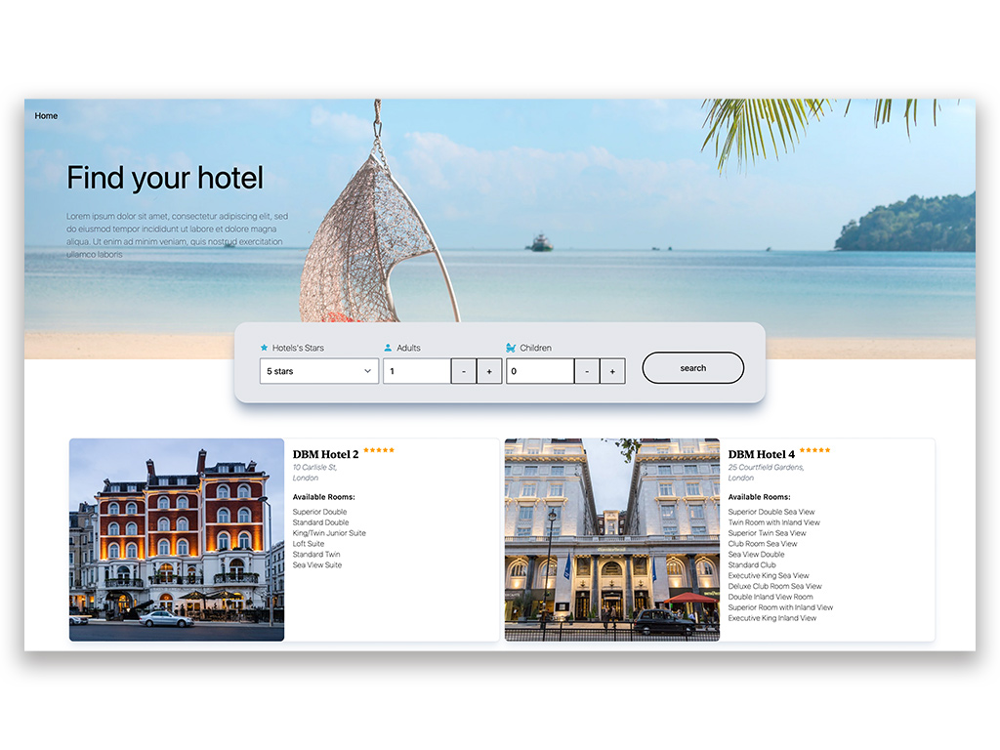

# Hotels App

Application showing a list of hotels and their rooms built with React, Typescript, Redux and Vite.
Fetching data using API, with received id query next query to fetch information about rooms.

Functionalities

- Filtering based on the star rating of the hotel,means that selecting 3 stars shows all hotels with a 3 and above rating.
- Filtering based on the capacity of the room, means that selecting 1 adult and 1 child shows all rooms with at least that capacity.
- Viewing all images of the displayed hotel
- Viewing hotel details (including hotel name, address and star rating) and room details (including room type, max adults, max children and long description)

## To get started

- clone repository with `git clone`
- go to the project directory `cd`
- install dependecies `npm install`
- start development server `npm run dev`
- to build production version run `npm run build`

## Covered Topics

- Creating application structure
- Application state management with Redux
- Custom hooks
- React Query
- Redux Toolkit, Redux Toolkit Query
- Migrating from JavaScript to Typescript
- Styling UI components with Tailwind CSS
- Error boundaries
- and much more
